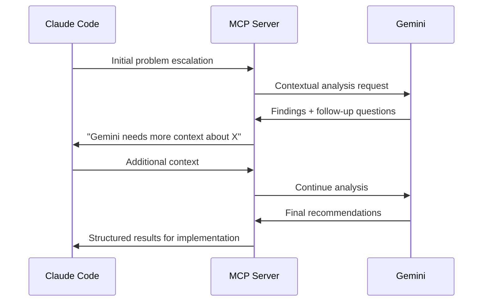

- [Deep Code Reasoning MCP Server - User Guide](#deep-code-reasoning-mcp-server---user-guide)
  - [Getting Started](#getting-started)
    - [What is the Deep Code Reasoning MCP Server?](#what-is-the-deep-code-reasoning-mcp-server)
    - [Key Benefits](#key-benefits)
    - [When to Use This Server](#when-to-use-this-server)
  - [Installation \& Setup](#installation--setup)
    - [Prerequisites](#prerequisites)
    - [Step 1: Installation Methods](#step-1-installation-methods)
      - [Option A: Quick Install for Cursor (Recommended)](#option-a-quick-install-for-cursor-recommended)
      - [Option B: Manual Installation](#option-b-manual-installation)
      - [Option C: npm Installation (Future)](#option-c-npm-installation-future)
    - [Step 2: Configuration](#step-2-configuration)
      - [Environment Variables](#environment-variables)
      - [MCP Configuration](#mcp-configuration)
    - [Step 3: Verification](#step-3-verification)
  - [Basic Usage](#basic-usage)
    - [Your First Analysis](#your-first-analysis)
      - [Step 1: Start with Claude Code](#step-1-start-with-claude-code)
      - [Step 2: Identify When to Escalate](#step-2-identify-when-to-escalate)
      - [Step 3: Use MCP Tools](#step-3-use-mcp-tools)
    - [Understanding Tool Responses](#understanding-tool-responses)
      - [Escalate Analysis Response](#escalate-analysis-response)
      - [Conversation Response](#conversation-response)
  - [Advanced Features](#advanced-features)
    - [Multi-Turn Conversations](#multi-turn-conversations)
    - [Hypothesis Testing](#hypothesis-testing)
    - [Health Monitoring](#health-monitoring)
    - [Performance Analysis](#performance-analysis)
    - [Cross-System Analysis](#cross-system-analysis)
  - [Troubleshooting](#troubleshooting)
    - [Common Issues](#common-issues)
      - [Server Won't Start](#server-wont-start)
      - [API Key Issues](#api-key-issues)
      - [Connection Errors](#connection-errors)
      - [Performance Issues](#performance-issues)
    - [Debug Mode](#debug-mode)
    - [Log Analysis](#log-analysis)
    - [Testing Tools Individually](#testing-tools-individually)
  - [Best Practices](#best-practices)
    - [Effective Tool Usage](#effective-tool-usage)
      - [1. Start Simple, Escalate Gradually](#1-start-simple-escalate-gradually)
      - [2. Provide Clear Context](#2-provide-clear-context)
      - [3. Use Appropriate Tools for Each Scenario](#3-use-appropriate-tools-for-each-scenario)
      - [4. Optimize for Performance](#4-optimize-for-performance)
    - [Workflow Integration](#workflow-integration)
      - [1. Claude Code → MCP Server Handoff](#1-claude-code--mcp-server-handoff)
      - [2. MCP Server → Claude Code Return](#2-mcp-server--claude-code-return)
      - [3. Multi-Model Collaboration](#3-multi-model-collaboration)
    - [Security Best Practices](#security-best-practices)
      - [1. API Key Management](#1-api-key-management)
      - [2. File Access Control](#2-file-access-control)
      - [3. Data Privacy](#3-data-privacy)
    - [Performance Optimization](#performance-optimization)
      - [1. Context Size Management](#1-context-size-management)
      - [2. Batch Operations](#2-batch-operations)
      - [3. Health Monitoring](#3-health-monitoring)

# Deep Code Reasoning MCP Server - User Guide

## Getting Started

### What is the Deep Code Reasoning MCP Server?

The Deep Code Reasoning MCP Server is a specialized tool that bridges Claude Code with Google's Gemini AI to provide advanced code analysis capabilities. It's designed to handle complex scenarios that benefit from Gemini's massive context window (1M+ tokens) and code execution abilities.

### Key Benefits

**For Claude Code Users:**

- Access to large context analysis (beyond Claude's limits)
- Advanced cross-system debugging capabilities
- Iterative hypothesis testing with code execution
- Multi-model AI collaboration for complex problems

**For Development Teams:**

- Comprehensive distributed system debugging
- Performance bottleneck identification
- Cross-service impact analysis
- Automated hypothesis validation

### When to Use This Server

✅ **Use when:**

- Analyzing large codebases (>100k tokens)
- Debugging distributed systems
- Need iterative analysis with multiple rounds
- Performance issues require deep execution tracing
- Cross-system impact analysis is needed

❌ **Don't use when:**

- Simple code reviews or formatting
- Quick syntax checks
- Small, isolated code changes
- Real-time debugging (use Claude Code directly)

## Installation & Setup

### Prerequisites

Before installing, ensure you have:

- **Node.js 18+** installed
- **TypeScript** support
- **Gemini API Key** from [Google AI Studio](https://makersuite.google.com/app/apikey)
- **VS Code or Cursor** with MCP extension

### Step 1: Installation Methods

#### Option A: Quick Install for Cursor (Recommended)

[](https://cursor.com/install-mcp?name=deep-code-reasoning&config=eyJjb21tYW5kIjoibm9kZSIsImFyZ3MiOlsiL3BhdGgvdG8vZGVlcC1jb2RlLXJlYXNvbmluZy1tY3AvZGlzdC9pbmRleC5qcyJdLCJlbnYiOnsiR0VNSU5JX0FQSV9LRVkiOiJ5b3VyLWdlbWluaS1hcGkta2V5In19)

*Note: After installation, update the file path and set your API key.*

#### Option B: Manual Installation

1. **Clone the repository:**
   ```bash
   git clone https://github.com/lucasgaldinos/mcp-server-deep-code-reasoning-mcp.git
   cd mcp-server-deep-code-reasoning-mcp
   ```

2. **Install dependencies:**
   ```bash
   npm install
   ```

3. **Build the project:**
   ```bash
   npm run build
   ```

#### Option C: npm Installation (Future)

   ```bash
   # Coming soon
   npm install -g deep-code-reasoning-mcp
   ```

### Step 2: Configuration

#### Environment Variables

Create a `.env` file in the project root:

```bash
# Required
GEMINI_API_KEY=your-gemini-api-key-here

# Optional
LOG_LEVEL=info                    # debug, info, warn, error
MAX_CONTEXT_SIZE=1000000         # Maximum context size for Gemini
HEALTH_CHECK_INTERVAL=30000      # Health check interval in ms
```

#### MCP Configuration

Add the server to your MCP configuration file:

**For VS Code** (`~/.vscode/mcp.json`):

```json
{
  "servers": {
    "deep-code-reasoning-mcp": {
      "command": "node",
      "args": ["/path/to/deep-code-reasoning-mcp/dist/index.js"],
      "env": {
        "GEMINI_API_KEY": "your-gemini-api-key"
      }
    }
  }
}
```

**For Cursor** (`~/.cursor/mcp.json`):

```json
{
  "servers": {
    "deep-code-reasoning-mcp": {
      "args": [
        "-c", 
        "cd /path/to/deep-code-reasoning-mcp && npm run build && GEMINI_API_KEY=your-key npm start"
      ],
      "command": "bash",
      "type": "stdio"
    }
  }
}
```

### Step 3: Verification

Test the installation:

```bash
# Test server startup
npm start

# Run health checks
npm test

# Verify tools are available
node -e "console.log('Server ready for MCP connections')"
```

## Basic Usage

### Your First Analysis

Let's walk through a typical analysis workflow:

#### Step 1: Start with Claude Code

Begin your analysis in Claude Code as usual:

```
I'm debugging a performance issue in our user service. The response time has increased from 100ms to 2000ms after our last deployment. I've checked:

- Database connection pools (seem fine)
- Recent code changes (nothing obvious)
- Server resources (CPU/memory normal)

The issue appears intermittent and affects about 30% of requests.
```

#### Step 2: Identify When to Escalate

Claude Code should escalate to this MCP server when it encounters:

- Large context requirements (multiple services, long logs)
- Need for iterative analysis
- Cross-system correlation requirements
- Performance bottleneck identification

#### Step 3: Use MCP Tools

Claude Code will automatically use the appropriate MCP tools. Common patterns:

**For Simple Analysis:**

```typescript
// Claude uses escalate_analysis
{
  "claude_context": {
    "attempted_approaches": ["Database checks", "Resource monitoring"],
    "partial_findings": [],
    "stuck_description": "Intermittent performance issue, root cause unclear",
    "code_scope": {
      "files": ["src/services/UserService.ts", "src/database/connection.ts"]
    }
  },
  "analysis_type": "performance",
  "depth_level": 3
}
```

**For Complex Investigation:**

```typescript
// Claude starts a conversation
{
  "claude_context": {
    "attempted_approaches": ["Local debugging", "Log analysis"],
    "partial_findings": [{"type": "performance", "details": "Response time spike"}],
    "stuck_description": "Need deep analysis of distributed system behavior",
    "code_scope": {
      "files": ["multiple files"],
      "service_names": ["user-service", "auth-service", "database"]
    }
  },
  "analysis_focus": "debugging",
  "depth_level": 4
}
```

### Understanding Tool Responses

#### Escalate Analysis Response

```typescript
{
  "analysis_id": "analysis_123",
  "findings": {
    "root_cause": "Database connection pool exhaustion during peak traffic",
    "evidence": ["Connection timeout patterns in logs", "Pool metrics correlation"],
    "confidence_level": 4
  },
  "recommendations": [
    "Increase connection pool size from 10 to 25",
    "Implement connection pooling monitoring",
    "Add circuit breaker for database calls"
  ],
  "execution_time": 45.2
}
```

#### Conversation Response

```typescript
{
  "session_id": "conv_456",
  "gemini_response": "I can see the connection pool exhaustion pattern. Let me analyze the timing correlation with your traffic spikes. Can you share the database connection metrics from the same time period?",
  "next_steps": [
    "Gather database connection metrics",
    "Check traffic patterns during incidents",
    "Review connection pool configuration"
  ]
}
```

## Advanced Features

### Multi-Turn Conversations

The conversational tools enable sophisticated AI-to-AI collaboration:

```typescript
// 1. Start conversation
start_conversation({
  claude_context: { /* complex problem context */ },
  analysis_focus: "debugging",
  depth_level: 4
})

// 2. Continue based on Gemini's questions
continue_conversation({
  session_id: "conv_456",
  message: "Here are the database metrics you requested...",
  include_code_snippets: true
})

// 3. Get final analysis
finalize_conversation({
  session_id: "conv_456", 
  summary_format: "actionable"
})
```

### Hypothesis Testing

For systematic problem-solving:

```typescript
// Test a specific theory
hypothesis_test({
  hypothesis: {
    description: "Database connection pool is exhausted during traffic spikes",
    type: "performance",
    confidence_level: 3
  },
  test_scope: {
    files: ["src/database/connection.ts", "logs/database.log"]
  }
})

// Or test multiple theories
run_hypothesis_tournament({
  hypotheses: [
    {
      id: "h1",
      description: "Connection pool exhaustion",
      type: "performance",
      confidence_level: 3
    },
    {
      id: "h2", 
      description: "Memory leak in request handling",
      type: "performance",
      confidence_level: 2
    }
  ],
  test_scope: { /* shared context */ }
})
```

### Health Monitoring

Monitor server health and performance:

```typescript
// Check specific component
health_check({ check_name: "gemini_api" })

// Get comprehensive health status
health_summary({ include_details: true })
```

### Performance Analysis

Deep performance investigation:

```typescript
// Trace execution path
trace_execution_path({
  entry_point: {
    file: "src/api/UserController.ts",
    line: 45,
    function_name: "getUser"
  },
  max_depth: 15,
  include_data_flow: true
})

// Identify bottlenecks
performance_bottleneck({
  code_path: {
    entry_point: { /* specific location */ },
    suspected_issues: ["database queries", "memory allocation"]
  },
  profile_depth: 4
})
```

### Cross-System Analysis

Understand system-wide impacts:

```typescript
cross_system_impact({
  change_scope: {
    files: ["src/services/UserService.ts"],
    service_names: ["user-service", "auth-service", "notification-service"]
  },
  impact_types: ["breaking", "performance"],
  analysis_depth: 3
})
```

## Troubleshooting

### Common Issues

#### Server Won't Start

**Problem**: `Error [ERR_MODULE_NOT_FOUND]`

**Solution**:

1. Ensure you've run `npm run build`
2. Check that `dist/` directory exists
3. Verify Node.js version (18+ required)

```bash
# Clean rebuild
rm -rf dist node_modules
npm install
npm run build
npm start
```

#### API Key Issues

**Problem**: `GEMINI_API_KEY is not configured`

**Solution**:

1. Verify API key is set in `.env` file
2. Check MCP configuration includes environment variables
3. Test API key validity:

```bash
# Test API key
curl -H "Authorization: Bearer YOUR_API_KEY" \
     https://generativelanguage.googleapis.com/v1/models
```

#### Connection Errors

**Problem**: MCP client can't connect to server

**Solution**:

1. Check server is running: `ps aux | grep deep-code-reasoning`
2. Verify MCP configuration path is correct
3. Check file permissions on executable
4. Review VS Code/Cursor MCP logs

#### Performance Issues

**Problem**: Slow response times

**Solution**:

1. Check health status: use `health_summary` tool
2. Monitor memory usage: use `health_check` with `memory_usage`
3. Reduce analysis depth levels
4. Limit file scope in requests

### Debug Mode

Enable detailed logging:

```bash
# Set debug mode
export LOG_LEVEL=debug
npm start

# Or in .env file
LOG_LEVEL=debug
```

### Log Analysis

Check logs for issues:

```bash
# View recent logs
tail -f logs/app.log

# Search for errors
grep "ERROR" logs/app.log

# Check health check results
grep "health_check" logs/app.log
```

### Testing Tools Individually

Test each tool separately:

```bash
# Test server startup
node dist/index.js &
PID=$!

# Test tools list
echo '{"jsonrpc":"2.0","id":1,"method":"tools/list","params":{}}' | \
  nc localhost 3000

# Clean up
kill $PID
```

## Best Practices

### Effective Tool Usage

#### 1. Start Simple, Escalate Gradually

```typescript
// ✅ Good: Start with focused analysis
escalate_analysis({
  analysis_type: "performance",
  depth_level: 2,
  claude_context: { /* specific problem */ }
})

// ❌ Avoid: Starting with maximum complexity
escalate_analysis({
  analysis_type: "cross_system", 
  depth_level: 5,  // Too deep initially
  claude_context: { /* vague problem */ }
})
```

#### 2. Provide Clear Context

```typescript
// ✅ Good: Specific, actionable context
{
  "attempted_approaches": [
    "Checked database connection pools in UserService.ts:45-67",
    "Reviewed error logs for pattern between 14:00-15:00 UTC",
    "Monitored CPU/memory during peak traffic"
  ],
  "stuck_description": "Response time increased 20x after deployment, affects 30% of /api/users requests",
  "code_scope": {
    "files": ["src/services/UserService.ts", "src/database/ConnectionPool.ts"],
    "entry_points": [{"file": "src/services/UserService.ts", "line": 45}]
  }
}

// ❌ Avoid: Vague context
{
  "attempted_approaches": ["debugging"],
  "stuck_description": "something is slow",
  "code_scope": {"files": ["src/"]}  // Too broad
}
```

#### 3. Use Appropriate Tools for Each Scenario

| Scenario | Recommended Tool | Depth Level |
|----------|------------------|-------------|
| Quick performance check | `performance_bottleneck` | 2-3 |
| Complex distributed issue | `start_conversation` | 3-4 |
| Cross-service impact | `cross_system_impact` | 2-3 |
| Systematic debugging | `run_hypothesis_tournament` | 3-4 |
| Execution flow analysis | `trace_execution_path` | 3-4 |

#### 4. Optimize for Performance

```typescript
// ✅ Good: Reasonable scope and timeouts
{
  "time_budget_seconds": 60,      // Reasonable timeout
  "depth_level": 3,               // Balanced depth
  "code_scope": {
    "files": ["specific", "relevant", "files"]  // Focused scope
  }
}

// ❌ Avoid: Excessive resource usage
{
  "time_budget_seconds": 300,     // Too long
  "depth_level": 5,               // Unnecessarily deep
  "code_scope": {
    "files": ["src/**/*"]         // Too broad
  }
}
```

### Workflow Integration

#### 1. Claude Code → MCP Server Handoff

**Ideal Handoff Point:**

- Claude has attempted 2-3 different approaches
- Context size exceeds Claude's optimal range
- Cross-system analysis is needed
- Iterative hypothesis testing would be beneficial

#### 2. MCP Server → Claude Code Return

**Return with:**

- Structured findings and recommendations
- Specific file locations and line numbers
- Actionable next steps
- Confidence levels for different findings

#### 3. Multi-Model Collaboration



### Security Best Practices

#### 1. API Key Management

```bash
# ✅ Good: Use environment variables
export GEMINI_API_KEY="your-key"

# ✅ Good: Use .env files (not committed)
echo "GEMINI_API_KEY=your-key" > .env

# ❌ Avoid: Hardcoding in configuration
{
  "env": {
    "GEMINI_API_KEY": "hardcoded-key"  // Don't do this
  }
}
```

#### 2. File Access Control

The server automatically validates file access:

- Only reads files within the workspace
- Validates all file paths for security
- Logs all file access for audit trails

#### 3. Data Privacy

- No persistent storage of code or analysis results
- Temporary session data cleared after completion
- Comprehensive audit logging available

### Performance Optimization

#### 1. Context Size Management

```typescript
// ✅ Optimize context size
{
  "code_scope": {
    "files": ["specific-files-only"],
    "entry_points": [{"file": "main.ts", "line": 100}]  // Focused entry
  }
}
```

#### 2. Batch Operations

```typescript
// ✅ Use hypothesis tournament for multiple theories
run_hypothesis_tournament({
  hypotheses: [theory1, theory2, theory3],  // Test all at once
  tournament_settings: {
    max_parallel: 3,           // Optimal parallelism
    timeout_per_hypothesis: 30 // Reasonable timeout
  }
})
```

#### 3. Health Monitoring

Regularly check system health:

```bash
# Daily health check
npm run health-check

# Monitor key metrics
curl -s localhost:3000/health | jq '.performance_metrics'
```

This user guide provides a comprehensive foundation for effectively using the Deep Code Reasoning MCP Server in your development workflow.
