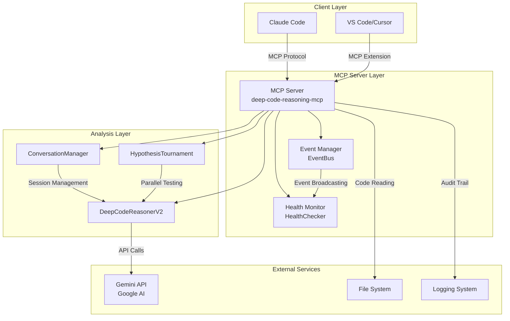
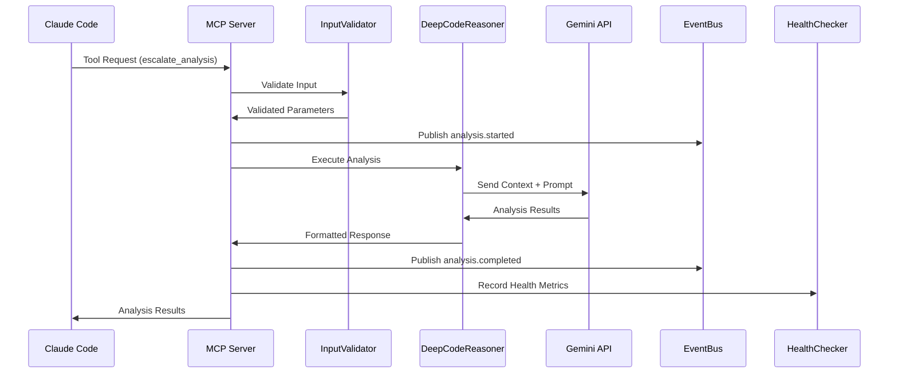
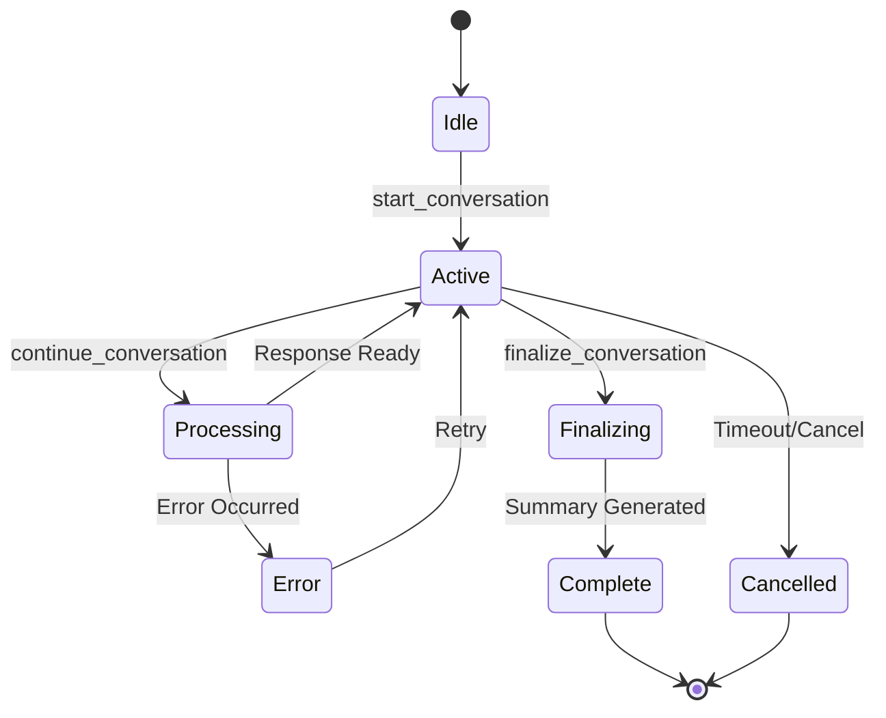

- [Deep Code Reasoning MCP Server - Architecture Overview](#deep-code-reasoning-mcp-server---architecture-overview)
  - [System Architecture](#system-architecture)
    - [High-Level Architecture Diagram](#high-level-architecture-diagram)
    - [Component Overview](#component-overview)
      - [1. MCP Server Core (`src/index.ts`)](#1-mcp-server-core-srcindexts)
      - [2. Analysis Engine (`src/analyzers/`)](#2-analysis-engine-srcanalyzers)
        - [DeepCodeReasonerV2 (`DeepCodeReasonerV2.ts`)](#deepcodereasonerv2-deepcodereasonerv2ts)
        - [Other Analyzers](#other-analyzers)
      - [3. Service Layer (`src/services/`)](#3-service-layer-srcservices)
        - [ConversationManager (`ConversationManager.ts`)](#conversationmanager-conversationmanagerts)
        - [HypothesisTournamentService (`HypothesisTournamentService.ts`)](#hypothesistournamentservice-hypothesistournamentservicets)
        - [GeminiService (`GeminiService.ts`)](#geminiservice-geminiservicets)
      - [4. Infrastructure Layer (`src/utils/`)](#4-infrastructure-layer-srcutils)
        - [EventBus (`EventBus.ts`)](#eventbus-eventbusts)
        - [HealthChecker (`HealthChecker.ts`)](#healthchecker-healthcheckerts)
        - [Other Utilities](#other-utilities)
    - [Data Flow Architecture](#data-flow-architecture)
      - [Request Processing Flow](#request-processing-flow)
      - [Conversation Flow](#conversation-flow)
    - [Integration Patterns](#integration-patterns)
      - [1. Multi-Model Routing](#1-multi-model-routing)
      - [2. Event-Driven Architecture](#2-event-driven-architecture)
      - [3. Health-First Design](#3-health-first-design)
    - [Scalability Considerations](#scalability-considerations)
      - [Horizontal Scaling](#horizontal-scaling)
      - [Performance Optimization](#performance-optimization)
    - [Security Architecture](#security-architecture)
      - [Input Validation](#input-validation)
      - [Data Protection](#data-protection)
    - [Technology Stack](#technology-stack)
      - [Core Technologies](#core-technologies)
      - [Development Tools](#development-tools)
      - [Dependencies](#dependencies)
    - [Deployment Architecture](#deployment-architecture)
      - [Local Development](#local-development)
      - [Production Deployment](#production-deployment)

# Deep Code Reasoning MCP Server - Architecture Overview

## System Architecture

The Deep Code Reasoning MCP Server implements a multi-model AI architecture that bridges Claude Code with Google's Gemini AI for complementary code analysis capabilities.

### High-Level Architecture Diagram



### Component Overview

#### 1. MCP Server Core (`src/index.ts`)

The main entry point that implements the Model Context Protocol (MCP) specification:

- **Protocol Compliance**: Full MCP v0.1.0 implementation
- **Tool Registration**: 13 specialized analysis tools
- **Request Routing**: Intelligent routing to appropriate analyzers
- **Error Handling**: Comprehensive error classification and recovery
- **Health Integration**: Built-in health monitoring endpoints

#### 2. Analysis Engine (`src/analyzers/`)

Specialized analyzers for different types of code analysis:

##### DeepCodeReasonerV2 (`DeepCodeReasonerV2.ts`)

- **Purpose**: Primary interface to Gemini AI for complex analysis
- **Capabilities**:
  - Large context processing (1M+ tokens)
  - Code execution simulation
  - Multi-file correlation analysis
  - Execution path tracing
- **Integration**: Direct Gemini API communication with retry logic

##### Other Analyzers

- **ExecutionTracer**: Deep execution path analysis
- **HypothesisTester**: Automated hypothesis validation
- **PerformanceModeler**: Performance bottleneck detection
- **SystemBoundaryAnalyzer**: Cross-service impact analysis

#### 3. Service Layer (`src/services/`)

##### ConversationManager (`ConversationManager.ts`)

- **Session Management**: Multi-turn conversation handling
- **State Persistence**: Conversation context maintenance
- **Escalation Logic**: Intelligent Claude→Gemini routing

##### HypothesisTournamentService (`HypothesisTournamentService.ts`)

- **Parallel Testing**: Simultaneous hypothesis validation
- **Result Aggregation**: Tournament-style result ranking
- **Resource Management**: Efficient batch processing

##### GeminiService (`GeminiService.ts`)

- **API Abstraction**: Clean Gemini API interface
- **Rate Limiting**: Intelligent request throttling
- **Error Recovery**: Robust retry mechanisms

#### 4. Infrastructure Layer (`src/utils/`)

##### EventBus (`EventBus.ts`)

- **Observer Pattern**: Decoupled event communication
- **Event Types**: Structured event taxonomy
- **Correlation**: Request tracking across components
- **Performance**: Efficient event routing

##### HealthChecker (`HealthChecker.ts`)

- **Health Monitoring**: Comprehensive system health tracking
- **Check Types**: Memory, system, component health
- **Alerting**: Proactive issue detection
- **Metrics**: Performance and availability metrics

##### Other Utilities

- **Logger**: Structured logging with correlation IDs
- **ErrorClassifier**: Intelligent error categorization
- **InputValidator**: Request validation and sanitization
- **SecureCodeReader**: Safe file system access

### Data Flow Architecture

#### Request Processing Flow



#### Conversation Flow



### Integration Patterns

#### 1. Multi-Model Routing

The server implements intelligent routing between Claude and Gemini based on:

- **Context Size**: Large contexts route to Gemini
- **Analysis Type**: Different tools for different problems
- **Performance Requirements**: Fast vs. thorough analysis
- **Resource Availability**: Load balancing across models

#### 2. Event-Driven Architecture

All components communicate through the EventBus:

- **Loose Coupling**: Components don't directly depend on each other
- **Extensibility**: Easy to add new analyzers and services
- **Monitoring**: Centralized event logging and metrics
- **Testing**: Event mocking for unit tests

#### 3. Health-First Design

Every component participates in health monitoring:

- **Proactive Monitoring**: Health checks before issues occur
- **Graceful Degradation**: Fallback mechanisms for failed components
- **Performance Tracking**: Real-time performance metrics
- **Alerting**: Automated issue detection and notification

### Scalability Considerations

#### Horizontal Scaling

- **Stateless Design**: Server instances can be scaled independently
- **Session Affinity**: Conversation state managed externally if needed
- **Load Balancing**: Multiple instances behind load balancer

#### Performance Optimization

- **Caching**: Result caching for repeated analyses
- **Parallel Processing**: Concurrent analysis execution
- **Resource Pooling**: Efficient resource utilization
- **Streaming**: Large result streaming for memory efficiency

### Security Architecture

#### Input Validation

- **Schema Validation**: Zod schemas for all inputs
- **Sanitization**: Content sanitization before processing
- **Path Validation**: Secure file system access
- **Rate Limiting**: API abuse prevention

#### Data Protection

- **No Persistent Storage**: Minimal data retention
- **Secure Communication**: HTTPS/TLS for all external calls
- **Access Control**: File system permission validation
- **Audit Logging**: Comprehensive audit trails

### Technology Stack

#### Core Technologies

- **Runtime**: Node.js 18+ with ES Modules
- **Language**: TypeScript with strict type checking
- **Protocol**: Model Context Protocol (MCP) v0.1.0
- **AI Integration**: Gemini API via @google/generative-ai

#### Development Tools

- **Build System**: TypeScript compiler with tsc-alias
- **Testing**: Jest with ES module support
- **Linting**: ESLint with TypeScript rules
- **Type Checking**: Strict TypeScript configuration

#### Dependencies

- **MCP SDK**: @modelcontextprotocol/sdk for protocol implementation
- **Validation**: Zod for runtime type validation
- **Environment**: dotenv for configuration management
- **AI Service**: @google/generative-ai for Gemini integration

### Deployment Architecture

#### Local Development

```tree
Developer Machine
├── VS Code/Cursor (Client)
├── MCP Server (Local Process)
└── Gemini API (External Service)
```

#### Production Deployment

```tree
Production Environment
├── Load Balancer
├── MCP Server Instances (N)
├── Health Check Endpoints
├── Monitoring & Logging
└── External Dependencies
    ├── Gemini API
    └── File System Storage
```

This architecture provides a robust, scalable foundation for multi-model AI code analysis while maintaining simplicity and reliability.
