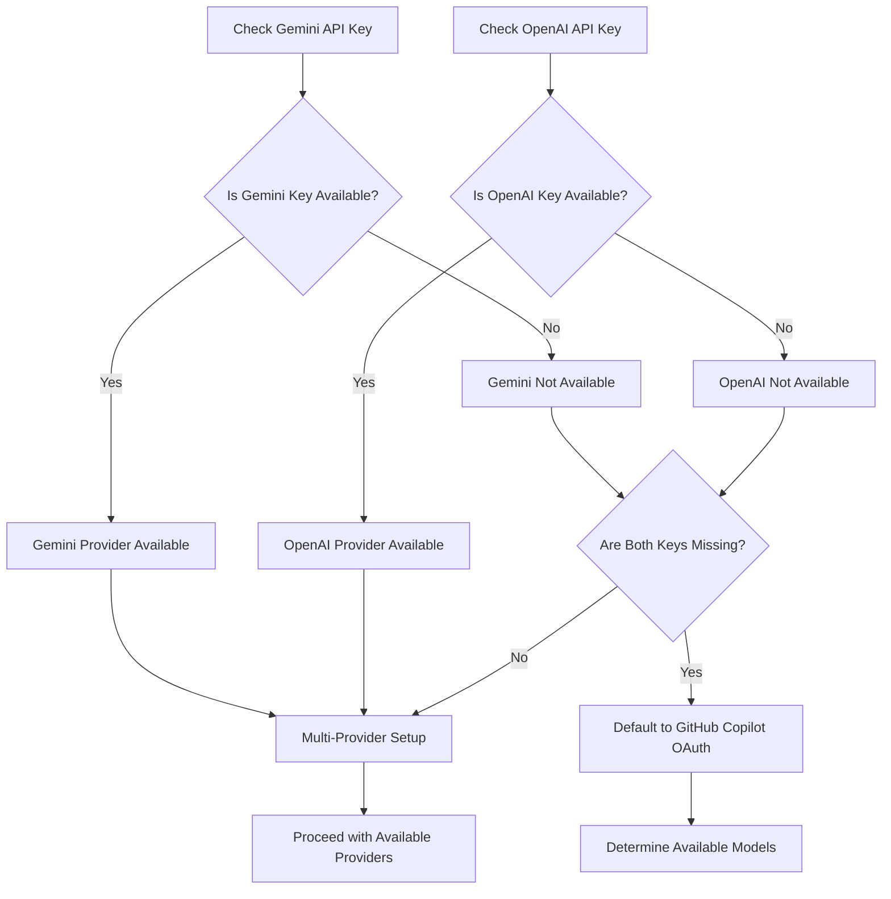

# MCP SDK Parameter Validation Research

## Research Overview

Comprehensive research into MCP SDK parameter validation issues affecting the Deep Code Reasoning MCP Server, conducted on September 20, 2025.

## Key Findings

### 1. Widespread MCP Parameter Validation Issues

**GitHub Issue #4188 (Claude Desktop)**

- **Timeline**: Broke suddenly on July 23, 2025 (worked perfectly until July 22, 2025)
- **Error Pattern**: `"expected": "object", "received": "undefined"`
- **Scope**: Multiple users on different computers experiencing simultaneously
- **Root Cause**: Claude Desktop not passing required parameters to MCP tools
- **Status**: High priority bug affecting all MCP functionality

**Flowise Issue #4621**

- **Error Pattern**: Different clients handling parameter serialization differently
- **Cursor AI**: Works correctly with parameters
- **Flowise**: Same parameters cause validation errors
- **Issue**: Different MCP clients sending parameters in different formats

### 2. MCP Protocol Specification (2025-06-18)

**Tool Call Format** (From specification):

```json
{
  "jsonrpc": "2.0",
  "id": 2,
  "method": "tools/call",
  "params": {
    "name": "get_weather",
    "arguments": {
      "location": "New York"
    }
  }
}
```

**Key Requirements**:

- Arguments MUST be passed in the `arguments` field as an object
- Parameters are validated against tool's `inputSchema` (JSON Schema)
- Tools MUST validate all inputs
- Clients SHOULD prompt for user confirmation on sensitive operations

### 3. VS Code and GitHub Copilot Integration

**Environment Variable Requirements**:

- MCP servers can use environment variables for authentication
- GitHub Copilot uses OAuth by default (no API key required)
- OpenAI integration requires `OPENAI_API_KEY`
- Custom MCP servers can implement fallback logic

**Configuration Pattern**:

```json
{
  "mcpServers": {
    "deep-code-reasoning": {
      "type": "local",
      "command": "npx",
      "args": ["tsx", "/path/to/src/index.ts"],
      "env": {
        "GEMINI_API_KEY": "${env:GEMINI_API_KEY}",
        "OPENAI_API_KEY": "${env:OPENAI_API_KEY}"
      },
      "tools": ["*"]
    }
  }
}
```

### 4. Current Server Status Analysis

**Working Tools (12/14 - 85.7%)**:

- debug_parameters, trace_execution_path, hypothesis_test
- cross_system_impact, performance_bottleneck
- start_conversation, continue_conversation, finalize_conversation, get_conversation_status
- health_check, health_summary, get_model_info, set_model

**Failing Tools (2/14)**:

- escalate_analysis: MCP SDK parameter validation bug
- run_hypothesis_tournament: MCP SDK parameter validation bug

**Root Cause**: Upstream MCP SDK bugs in parameter validation even with correct schema definitions

## Environment Variable Independence Strategy

### Current Issues

1. `.env` file dependency creates startup friction
2. Missing API keys break functionality entirely
3. No graceful degradation when providers unavailable

### Proposed Solution

```typescript
// Multi-provider fallback logic
const getAvailableProviders = () => {
  const providers = [];
  
  if (process.env.GEMINI_API_KEY) {
    providers.push({ name: 'gemini', priority: 1 });
  }
  
  if (process.env.OPENAI_API_KEY) {
    providers.push({ name: 'openai', priority: 2 });
  }
  
  // GitHub Copilot doesn't need API key - uses OAuth
  providers.push({ name: 'copilot', priority: 3 });
  
  return providers;
};
```

### Environment Variable Flow



## Immediate Action Items

### 1. MCP SDK Parameter Validation Fixes

- Remove dual camelCase/snake_case support causing conflicts
- Align all schemas to snake_case (MCP standard)
- Implement parameter validation workarounds for SDK bugs

### 2. Environment Variable Independence

- Remove startup `.env` prompts
- Implement graceful provider fallback
- Add GitHub Copilot OAuth integration

### 3. Tool Validation

- Fix remaining 2 tools affected by MCP SDK bugs
- Implement comprehensive parameter validation testing
- Create automated tool validation pipeline

## Research Sources

1. **GitHub Issue #4188**: Claude Desktop MCP parameter validation failure
2. **Flowise Issue #4621**: MCP client parameter serialization differences  
3. **MCP Specification 2025-06-18**: Official protocol documentation
4. **GitHub Copilot MCP Integration Docs**: VS Code and environment setup
5. **BytePlus MCP SDK Guide**: 2025 features and integration patterns

## Next Steps

1. Create comprehensive execution plan based on research findings
2. Implement actor-critic evaluation of proposed solutions  
3. Execute systematic fixes with proper error logging
4. Test until 100% tool functionality achieved
